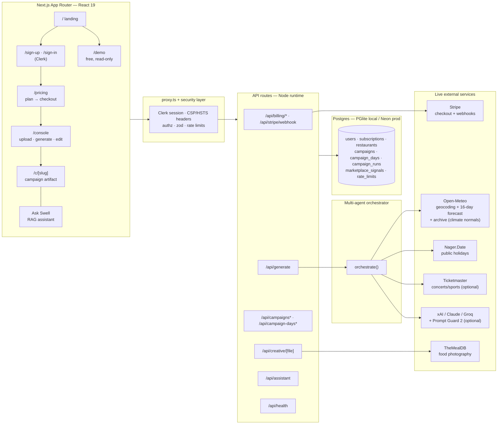
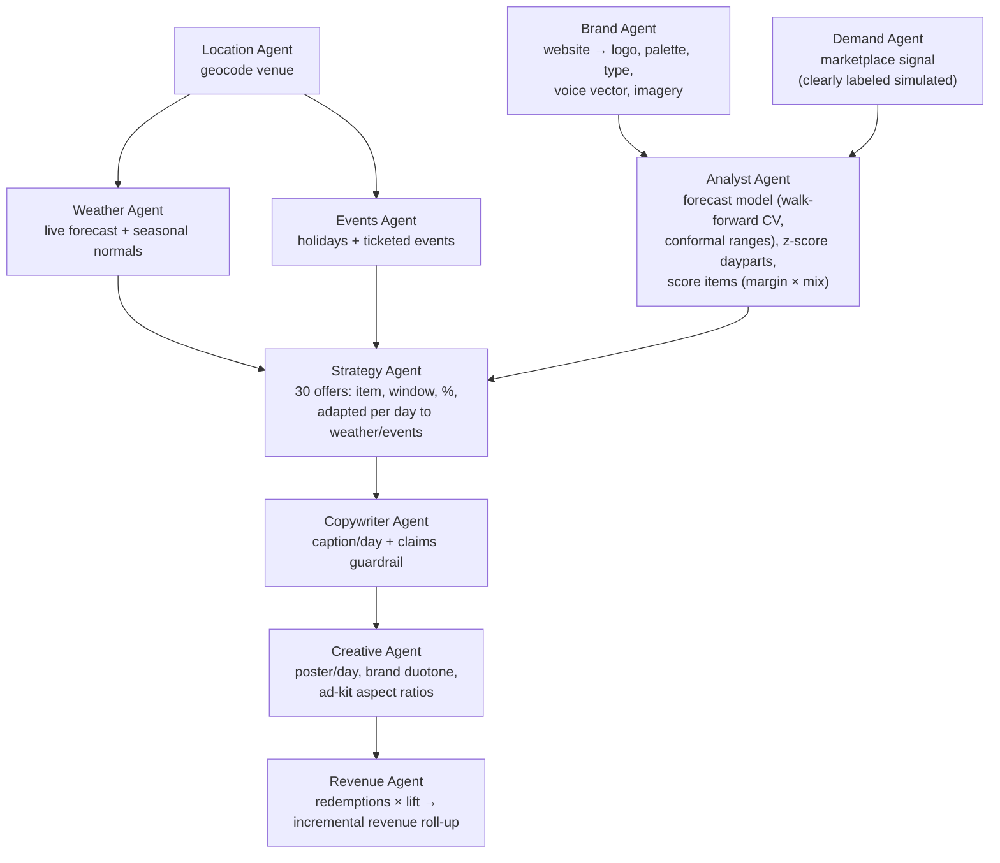
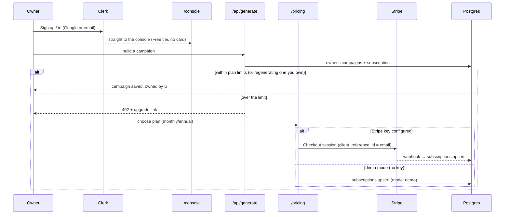
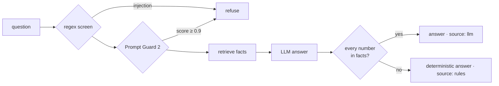
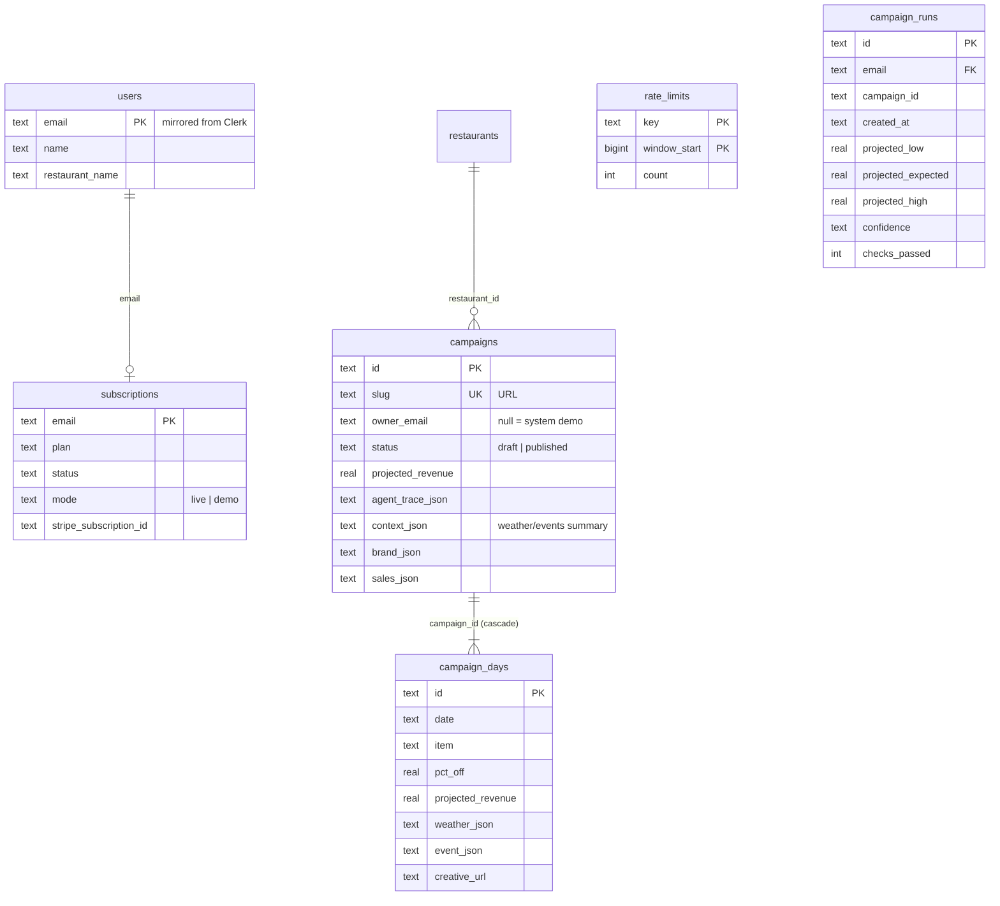

# Swell — Architecture

End-to-end architecture of the Swell operator platform: a multi-agent AI system that
turns a restaurant's POS export + website + location into a 30-day, weather- and
event-aware promotional campaign with revenue projections, branded creative, ad kit,
and a grounded assistant — behind real auth, tenant isolation, AI guardrails and
subscription billing.

**Live:** https://swell-ten-theta.vercel.app · health: [`/api/health`](https://swell-ten-theta.vercel.app/api/health)

## System overview



## The agent pipeline

`src/lib/orchestrator.ts` coordinates ten specialised agents on a shared context.
Every run records a per-agent trace (`agent_trace`) that renders in the artifact
sidebar — inputs, decisions, and wall-clock ms are inspectable.



**Agent contracts** (all in `src/lib/`):

| Agent | Module | Input → Output |
|---|---|---|
| Brand | `brand.ts` | URL → `BrandKit` (logo, colors, fonts, voice vector, image URLs); name from SEO titles by matching the domain, white/black/grey never accepted as the brand colour |
| Demand | `marketplace.ts` | slug → `MarketplaceSignals` (`simulated: true` until real app data) |
| Location | `context/geo.ts` | free-text location → lat/lon/country (Open-Meteo geocoding); searches one address part at a time and lets the rest (city, state) choose among matches |
| Weather | `context/weather.ts` | lat/lon → 30-day `DayWeather` map: live 16-day forecast, then climate normals (`source: "seasonal"`) for the tail |
| Events | `context/events.ts` | country+coords+dates → holidays (Nager.Date) ∪ ticketed events (Ticketmaster, optional key) |
| Analyst | `generator.ts:analyzeSales` + `model.ts:trainSalesModel` | daypart z-scores + item scores, **plus** model selection among 3 forecasters (seasonal mean, ridge weekday, ridge trend+weekday) by 30-day walk-forward CV with a seasonal-naive benchmark, horizon-banded split-conformal intervals and cross-conformal coverage; learns trend, strongest/weakest days, anomaly days |
| Strategy | `generator.ts:buildDayPlan` | all of the above → 30 `RawDay`s (weather/event deltas applied) |
| Copywriter | `copy.ts` | day plan + voice → caption <80 chars, prohibited-claims guardrail; LLM optional, deterministic fallback |
| Creative | `creative.ts` + `poster-fonts.ts` | day + brand → poster PNG (photo duotone or brand gradient) in 4 aspect ratios; text in bundled Geist via fontconfig (serverless hosts have no fonts) |
| Revenue | `generator.ts:assembleCampaign` + `project.ts` | days → projections, baseline, strategy notes |

### Revenue model (the projection math)

Per day (`src/lib/project.ts`):

```
reachable      = (dow_orders / dow_occurrences) × daypart_share      # measured
response_rate  = (0.12 + pct_off/100 × 0.7) × responseScale          # ASSUMED
redemptions    = max(3, reachable × response_rate × marketplace_lift)
incremental $  = redemptions × avg_check × (1 − pct_off) × incrementality  # ASSUMED
```

Weather/event deltas shift `pct_off` (±3–5pts) and item selection (comfort vs light
affinity regexes); events multiply expected covers (prep hint). A seasonal-normal day
moves `pct_off` half as far as a forecast day. Every figure shown in the UI (Report
charts, sidebar, assistant) derives from these persisted numbers — nothing is invented
at render time.

### Confidence range (`src/lib/validate.ts`)

`responseScale` and `incrementality` are the two inputs a POS export cannot reveal: how
many guests act on an offer, and how much of that spend is genuinely new. Rather than
decorate the point estimate with an invented ±, `validate.ts` re-runs the *same*
`projectDay()` at the pessimistic and optimistic edges of both — a sensitivity analysis:

```
spread         = min(0.75, 0.40 × volumeFactor(days_of_history))
low            = Σ projectDay(day, responseScale = 1 − spread, incrementality = 0.40)
expected       = Σ projectDay(day, responseScale = 1,          incrementality = 0.55)
high           = Σ projectDay(day, responseScale = 1 + spread, incrementality = 0.70)
```

Thin history widens the band (`volumeFactor` ≤ 1.5). Confidence is **capped at moderate**
while the demand multiplier is simulated, and drops to **low** under 21 days of history.
The same module runs real checks against the generated plan (30 days present, discounts
in the 10–45% guardrail, redemptions never exceeding expected covers, weather on every
day, captions under 80 chars, uplift a plausible size) and reports what failed.

## Real-time context loop

- Campaigns start **today**, so the first ~16 days sit inside the live forecast horizon.
- The remaining ~14 days are filled with **climate normals** — the average of that exact
  calendar date over the last 5 years, from Open-Meteo's free archive API. They carry
  `source: "seasonal"`, are labelled "est." in the UI, move the discount **half** as far
  as a real forecast, and are **withheld from the copywriter** so no caption can ever
  claim "Rainy Saturday?" off an estimate.
- All context calls are **resilient**: timeout-guarded, cached per process, and degrade
  to a sales-history-only plan (no key, no location, API hiccup → still generates).
- Regenerating a campaign re-pulls weather/events; a scheduled daily regenerate (Vercel
  Cron hitting `/api/generate`) keeps the plan current as conditions change.

## Auth & billing flow



- **Identity**: **Clerk** (`@clerk/nextjs`), Google + email. `src/proxy.ts` protects only
  `/console`, `/account` and the mutating API routes — the landing page, `/pricing`,
  `/demo` and the public campaign artifact stay open. The hand-rolled scrypt/HMAC auth
  was deleted.
- **Mirroring**: the Clerk email is the account key; `getAccount()` creates the local
  `users` row on first sight (`src/lib/billing/account.ts`).
- **Binding**: `/api/billing/bind` refuses a Checkout session whose `client_reference_id`
  is not the signed-in email, and requires `status === "complete"`.
- **Plans**: Free (1 restaurant, 1 campaign/month) then Starter/Pro/Agency with limits
  (restaurants, campaigns/month, ad kit, auto-publish, white-label) in `src/lib/billing/plans.ts`.
  `src/lib/billing/quota.ts` decides, per owner, whether a new campaign may be saved;
  regenerating a campaign you already own never counts. Enforced in `/api/generate` (402).

## RAG assistant ("Ask Swell")

`src/lib/assistant.ts` — deliberately grounded:

1. **Facts**: the campaign is flattened into ~35 chunks (overview, revenue, per-day
   offer + weather/event rationale, strategy, how-to) — every number comes from the DB row.
2. **Retrieve**: keyword/tag scoring ranks chunks against the question.
3. **Answer**:
   - *keyless* → intent-matched deterministic answers; if retrieval confidence is low it
     **says "I don't have that"** and lists what it can answer — it never stitches
     unrelated facts;
   - *with `XAI_API_KEY`/`ANTHROPIC_API_KEY`/`GROQ_API_KEY`* → LLM generation constrained
     to the retrieved chunks with a no-invention system prompt.
4. **Guard**:
   - *before* — `screenQuestion()` (regex) and `injectionScore()` (Llama Prompt Guard 2,
     refuse ≥ 0.9) stop prompt injection before retrieval or generation;
   - *after* — `unsupportedNumbers()` extracts every $, % and count from the answer; any
     figure not supported by the retrieved facts (±5% rounding) discards the LLM answer
     and the deterministic engine answers instead (`source: "rules"`).



## Data model



`campaign_runs` exists because regenerating **replaces** the campaign row (its public URL
must stay stable). Without the run log there would be no record that an earlier
generation ever happened, or what it projected at the time.

**Storage**: one SQL dialect (Postgres) everywhere — embedded **PGlite** (WASM) in dev,
**Neon**/any Postgres in prod via `DATABASE_URL`. No native modules → clean Vercel
serverless builds. Schema auto-creates + column migrations run idempotently on boot
(`src/lib/db.ts`).

## API surface

Access: **public** = anyone · **viewer** = published/demo, or the owner of a draft ·
**owner** = the signed-in owner · **user** = any signed-in account. Limits are per user
or per IP, per window.

| Route | Method | Access | Limit | Purpose |
|---|---|---|---|---|
| `/sign-in` `/sign-up` | — | public | Clerk | Clerk-hosted auth (Google + email) |
| `/api/billing/checkout` | POST | user | — | Stripe Checkout (or instant demo sub) |
| `/api/billing/me` | GET | user | — | user + subscription + tier + this account's usage |
| `/api/billing/portal · bind` | POST | user | — | Stripe portal / post-checkout bind (refuses others' sessions) |
| `/api/stripe/webhook` | POST | Stripe signature | — | subscription lifecycle sync |
| `/api/parse-csv` | POST | user | 40/h | CSV/XLSX (gzipped by the browser; ≤ 15 MB on the wire, 80 MB inflated) → `ParsedSalesSummary` + detected venue (rejects <14 days) |
| `/api/brand-kit` | POST | user | 30/h | URL → `BrandKit` via SSRF-safe fetch |
| `/api/generate` | POST | user | 10/h + plan quota | zod-validated orchestration → campaign owned by caller; 402 over plan limits |
| `/api/campaigns` | GET | user | — | **your** campaigns only |
| `/api/campaigns/[slug]` | GET · DELETE | viewer · owner | — | read / delete |
| `/api/campaigns/[slug]/action` | POST | owner | — | activate · pause · publish · archive |
| `/api/campaigns/[slug]/calendar` | GET | viewer | — | `.ics` feed |
| `/api/campaign-days/[id]` | PATCH | owner | — | inline edit; caption guardrail; projections recompute server-side |
| `/api/creative/[file]` | GET | viewer | 400/min/IP | poster/ad PNG (`?ratio=`) |
| `/api/campaigns/[slug]/proof` | POST | owner | 20/h | upload post-campaign export → measured lift (Proof) |
| `/api/runs` | GET | user | — | this account's generation history |
| `/api/assistant` | POST | viewer | per user + IP | guarded, grounded Q&A over one campaign |
| `/api/health` | GET | public | 60/min/IP | database + LLM status, commit SHA (no secrets) |

## Deployment topology

- **Vercel** (Node serverless functions) + **Neon** Postgres — both free tier.
- Weather/geocoding/holidays are keyless public APIs called at request time.
- Env: `DATABASE_URL`, `NEXT_PUBLIC_BASE_URL`, Clerk (`NEXT_PUBLIC_CLERK_PUBLISHABLE_KEY`,
  `CLERK_SECRET_KEY`); optional `STRIPE_SECRET_KEY`/`STRIPE_WEBHOOK_SECRET`,
  `XAI_API_KEY`/`ANTHROPIC_API_KEY`/`GROQ_API_KEY` (+ `GROQ_MODEL`, `ANTHROPIC_MODEL`),
  `TICKETMASTER_API_KEY`.
- CI: GitHub Actions on Node 24 (`npm ci → typecheck → lint → test → build`) on every push/PR;
  Vercel deploys `main` to production.
- Observability: `/api/health` for uptime monitors; LLM failures are logged per provider/model
  (`[llm] provider/model failed: …`) and surfaced in the health payload.

## Forecast model (`src/lib/model.ts`)

```
daily sales ─▶ walk-forward folds (origin every 7d, 30-day horizon, train ≤ origin only)
            ─▶ 3 candidates scored out-of-sample  ─▶ min MAE (parsimony within 2%)
            ─▶ residuals tagged by horizon h ─▶ conformal q80/q95 for h∈[1-7],[8-14],[15-30]
            ─▶ refit winner on all data ─▶ predict / predictInterval (√(h/30) widening past 30)
```

All date math is UTC. `test/model.test.ts` checks recovery of known structure, beating the
naive benchmark, out-of-time and Monte-Carlo interval coverage, parsimony, non-negativity and
timezone invariance.

## Proof (`src/lib/proof.ts`)

```
POS export after the campaign ─▶ daily totals + item lines (date, daypart, item, qty)
model trained on the ORIGINAL upload ─▶ counterfactual per campaign day + 80% interval
lift = Σ(actual − counterfactual)  ·  80% range = lift ± 1.28·√Σσ²  (σ from each day's band)
promo windows: units of the dish in its daypart vs mean of same weekday + window pre-campaign
verdict: < 7 days → too early · low80 > 0 → proven · lift > 0 → promising · else no lift
```

The uploaded file never trains the model it is judged against. Owner-only
(`POST /api/campaigns/[slug]/proof`, 20/h), stored as `campaigns.proof_json`, shown on the
Proof tab and the money card.

## Security model

- **AuthZ** — `lib/authz.ts` is the only place access is decided (`canView`, `canEdit`,
  `requireOwner` → 401/404/403, `requireViewer`, `toPublic`). 404 rather than 403 for drafts you
  can't see, so private campaigns don't confirm they exist.
- **SSRF** — `lib/safe-fetch.ts`: undici `Agent` with a guarded `lookup` over a `net.BlockList`
  (private, loopback, link-local/metadata, CGNAT, ULA, IPv4-mapped), manual redirect
  re-validation, streamed size caps.
- **AI** — input: regex + Prompt Guard 2 (score ≥ 0.9 refused, fails open); output:
  grounded-number check; captions: claims guardrail. Every AI path has a deterministic fallback.
- **Abuse** — Postgres fixed-window rate limits per user / IP on generate, upload, brand-kit,
  assistant, creative and health.
- Tests: `test/security.test.ts`, `test/ai-guardrails.test.ts`, `test/ingest.test.ts`,
  `test/poster-fonts.test.ts`, `test/quota.test.ts`, `test/proof.test.ts`.

## Honesty guarantees (by design)

- Marketplace demand is **labeled `simulated`** in data and UI until real consumer-app
  data exists — no invented "saves" presented as real.
- The assistant answers **only** from persisted campaign facts and says so when it can't.
- Projections show their inputs (Report → "What the brain read") and recompute through
  the same `project.ts` math when a day is edited.
- The headline number is always shown as a **range with a confidence label**, and every
  assumption behind it is tagged `measured` / `assumed` / `simulated` in the Report.
- Weather past the 16-day forecast horizon is a labelled **seasonal estimate**, never
  presented as a forecast, and is withheld from the copywriter.
- Every generation is logged to `campaign_runs`, so a regenerate cannot quietly rewrite
  what the brain projected last week.
- The assistant is forbidden from inventing product features — it will not tell an owner
  to "compare actual vs projected", because Swell does not track that.

## Scaling path (not yet built)

Multi-restaurant workspaces and team seats on top of the existing per-campaign ownership,
nonce-based CSP (drop `'unsafe-inline'`), background job queue for poster rendering (currently request-time + disk cache), Meta/
Google Ads OAuth publish (assets are already exported in every required aspect ratio),
and read replicas if artifact traffic outgrows a single Neon instance.
