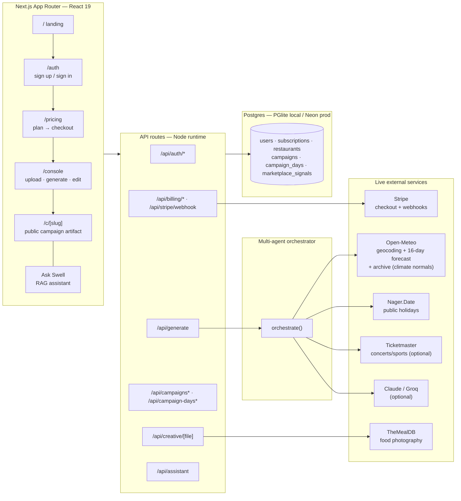
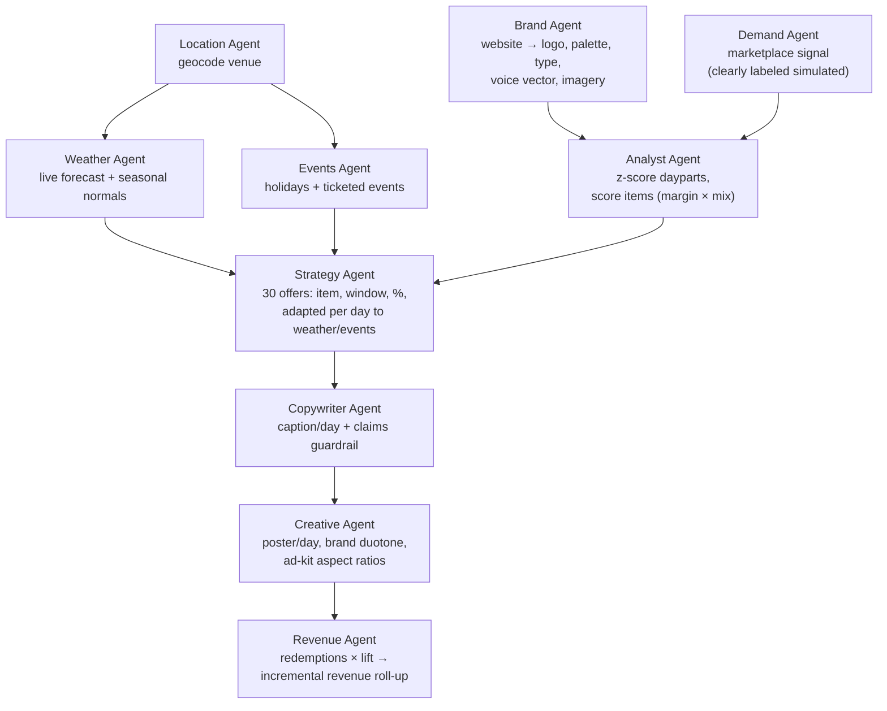
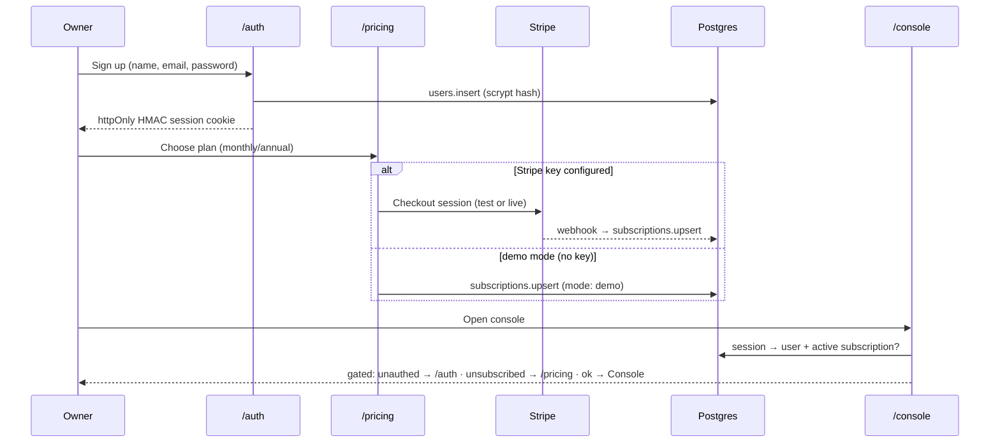
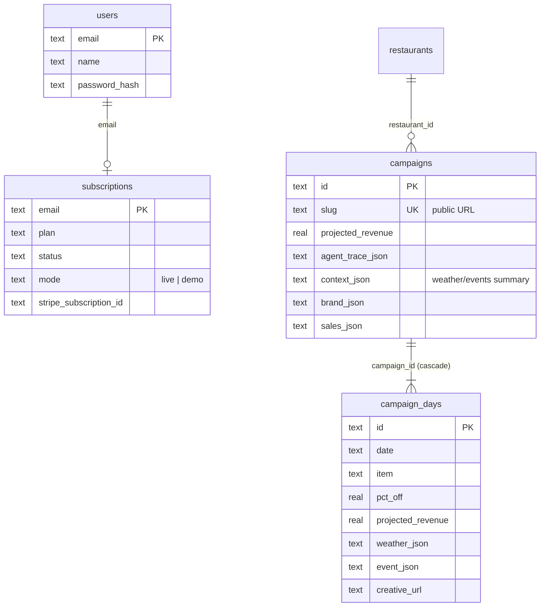

# Swell — Architecture

End-to-end architecture of the Swell operator platform: a multi-agent AI system that
turns a restaurant's POS export + website + location into a 30-day, weather- and
event-aware promotional campaign with revenue projections, branded creative, ad kit,
and a grounded assistant — behind real auth and subscription billing.

## System overview



## The agent pipeline

`src/lib/orchestrator.ts` coordinates ten specialised agents on a shared context.
Every run records a per-agent trace (`agent_trace`) that renders in the artifact
sidebar — inputs, decisions, and wall-clock ms are inspectable.



**Agent contracts** (all in `src/lib/`):

| Agent | Module | Input → Output |
|---|---|---|
| Brand | `brand.ts` | URL → `BrandKit` (logo, colors, fonts, voice vector, image URLs) |
| Demand | `marketplace.ts` | slug → `MarketplaceSignals` (`simulated: true` until real app data) |
| Location | `context/geo.ts` | free-text location → lat/lon/country (Open-Meteo geocoding) |
| Weather | `context/weather.ts` | lat/lon → 30-day `DayWeather` map: live 16-day forecast, then climate normals (`source: "seasonal"`) for the tail |
| Events | `context/events.ts` | country+coords+dates → holidays (Nager.Date) ∪ ticketed events (Ticketmaster, optional key) |
| Analyst | `generator.ts:analyzeSales` | `ParsedSalesSummary` → daypart z-scores + item scores |
| Strategy | `generator.ts:buildDayPlan` | all of the above → 30 `RawDay`s (weather/event deltas applied) |
| Copywriter | `copy.ts` | day plan + voice → caption <80 chars, prohibited-claims guardrail; LLM optional, deterministic fallback |
| Creative | `creative.ts` | day + brand → poster PNG (photo duotone or brand gradient) in 4 aspect ratios |
| Revenue | `generator.ts:assembleCampaign` + `project.ts` | days → projections, baseline, strategy notes |

### Revenue model (the projection math)

Per day (`src/lib/project.ts`):

```
reachable      = (dow_orders / dow_occurrences) × daypart_share
response_rate  = clamp(0.12 + pct_off/100 × 0.7, 0.10, 0.55)
redemptions    = max(3, reachable × response_rate × marketplace_lift)
incremental $  = redemptions × avg_check × (1 − pct_off) × 0.55
```

Weather/event deltas shift `pct_off` (±3–5pts) and item selection (comfort vs light
affinity regexes); events multiply expected covers (prep hint). Every figure shown in
the UI (Report charts, sidebar, assistant) derives from these persisted numbers —
nothing is invented at render time.

## Real-time context loop

- Campaigns start **today**, so the first ~16 days sit inside the live forecast horizon.
- The remaining ~14 days are filled with **climate normals** — the average of that exact
  calendar date over the last 5 years, from Open-Meteo's free archive API. They carry
  `source: "seasonal"`, are labelled "est." in the UI, move the discount **half** as far
  as a real forecast, and are **withheld from the copywriter** so no caption can ever
  claim "Rainy Saturday?" off an estimate.
- All context calls are **resilient**: timeout-guarded, cached per process, and degrade
  to a sales-history-only plan (no key, no location, API hiccup → still generates).
- Regenerating a campaign re-pulls weather/events; a scheduled daily regenerate (Vercel
  Cron hitting `/api/generate`) keeps the plan current as conditions change.

## Auth & billing flow



- **Passwords**: `scrypt` (N=16384, r=8, p=1), per-user salt, timing-safe compare — node
  stdlib, no dependencies (`src/lib/auth.ts`).
- **Sessions**: email signed with HMAC-SHA256 (`SWELL_SESSION_SECRET`) in an httpOnly,
  SameSite=Lax cookie (`src/lib/billing/account.ts`).
- **Plans**: Starter/Pro/Agency with limits (restaurants, campaigns/month, ad kit,
  auto-publish, white-label) in `src/lib/billing/plans.ts`; usage metered from the DB.

## RAG assistant ("Ask Swell")

`src/lib/assistant.ts` — deliberately grounded:

1. **Facts**: the campaign is flattened into ~35 chunks (overview, revenue, per-day
   offer + weather/event rationale, strategy, how-to) — every number comes from the DB row.
2. **Retrieve**: keyword/tag scoring ranks chunks against the question.
3. **Answer**:
   - *keyless* → intent-matched deterministic answers; if retrieval confidence is low it
     **says "I don't have that"** and lists what it can answer — it never stitches
     unrelated facts;
   - *with `ANTHROPIC_API_KEY`/`GROQ_API_KEY`* → LLM generation constrained to the
     retrieved chunks with a no-invention system prompt.

## Data model



**Storage**: one SQL dialect (Postgres) everywhere — embedded **PGlite** (WASM) in dev,
**Neon**/any Postgres in prod via `DATABASE_URL`. No native modules → clean Vercel
serverless builds. Schema auto-creates + column migrations run idempotently on boot
(`src/lib/db.ts`).

## API surface

| Route | Method | Purpose |
|---|---|---|
| `/api/auth/signup · signin · logout` | POST | account lifecycle (session cookie) |
| `/api/billing/checkout` | POST | Stripe Checkout (or instant demo sub); requires session |
| `/api/billing/me` | GET | user + subscription + plan + usage |
| `/api/billing/portal · bind` | POST | Stripe billing portal / post-checkout cookie bind |
| `/api/stripe/webhook` | POST | subscription lifecycle sync (signature-verified) |
| `/api/parse-csv` | POST | Toast/Square CSV/XLSX → `ParsedSalesSummary` (rejects <14 days) |
| `/api/brand-kit` | POST | URL → `BrandKit` |
| `/api/generate` | POST | full orchestration → persisted campaign (+ poster prewarm) |
| `/api/campaigns` `[slug]` `[slug]/action` | GET/POST/DELETE | list/read/activate/publish/archive |
| `/api/campaign-days/[id]` | PATCH | inline edit; projections recompute server-side |
| `/api/creative/[file]` | GET | poster/ad PNG (sharp; disk-cached; `?ratio=` for ad sizes) |
| `/api/assistant` | POST | grounded Q&A over one campaign |

## Deployment topology

- **Vercel** (Node serverless functions) + **Neon** Postgres — both free tier.
- Weather/geocoding/holidays are keyless public APIs called at request time.
- Env: `DATABASE_URL`, `SWELL_SESSION_SECRET`, `NEXT_PUBLIC_BASE_URL`; optional
  `STRIPE_SECRET_KEY`/`STRIPE_WEBHOOK_SECRET`, `ANTHROPIC_API_KEY`/`GROQ_API_KEY`,
  `TICKETMASTER_API_KEY`.
- CI: GitHub Actions (`npm ci → lint → build`) on every push/PR.

## Honesty guarantees (by design)

- Marketplace demand is **labeled `simulated`** in data and UI until real consumer-app
  data exists — no invented "saves" presented as real.
- The assistant answers **only** from persisted campaign facts and says so when it can't.
- Projections show their inputs (Report → "What the brain read") and recompute through
  the same `project.ts` math when a day is edited.

## Scaling path (not yet built)

Multi-restaurant workspaces per account → row-level ownership (`campaigns.owner_email`),
background job queue for poster rendering (currently request-time + disk cache), Meta/
Google Ads OAuth publish (assets are already exported in every required aspect ratio),
and read replicas if artifact traffic outgrows a single Neon instance.
