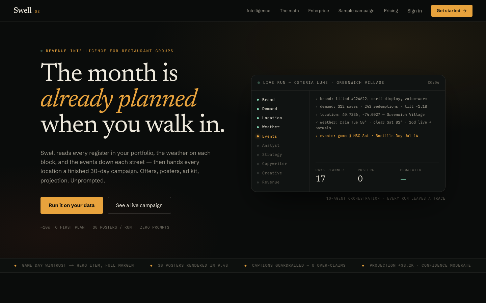
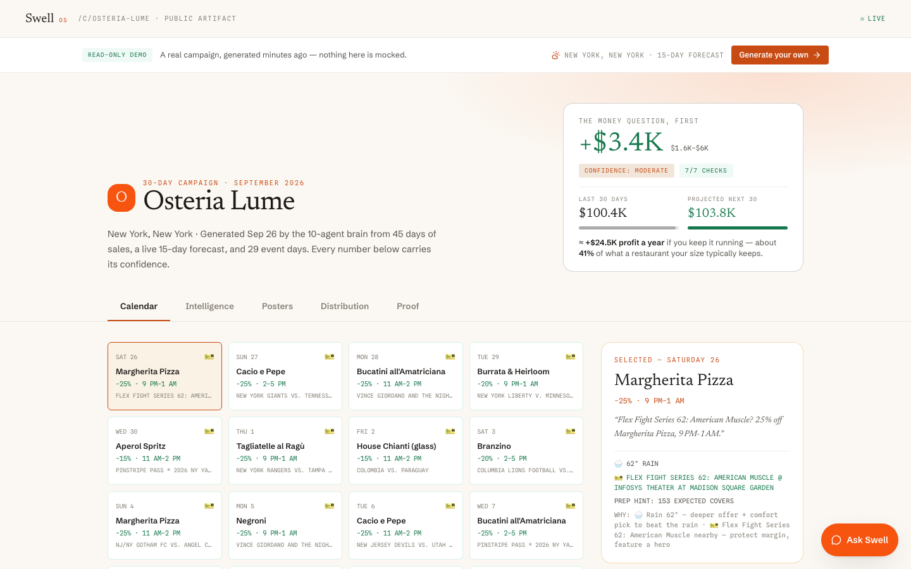
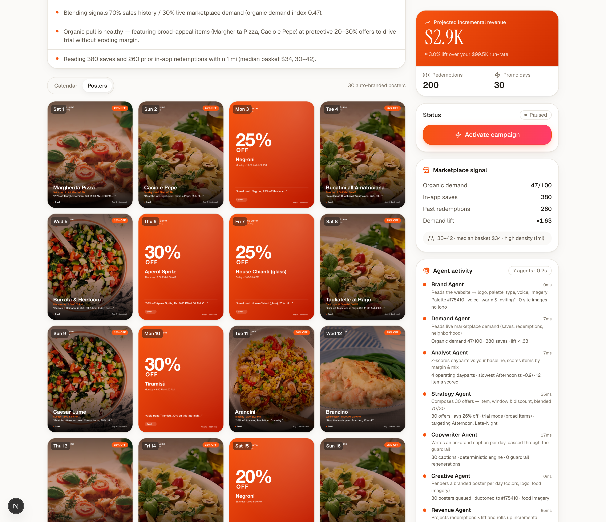
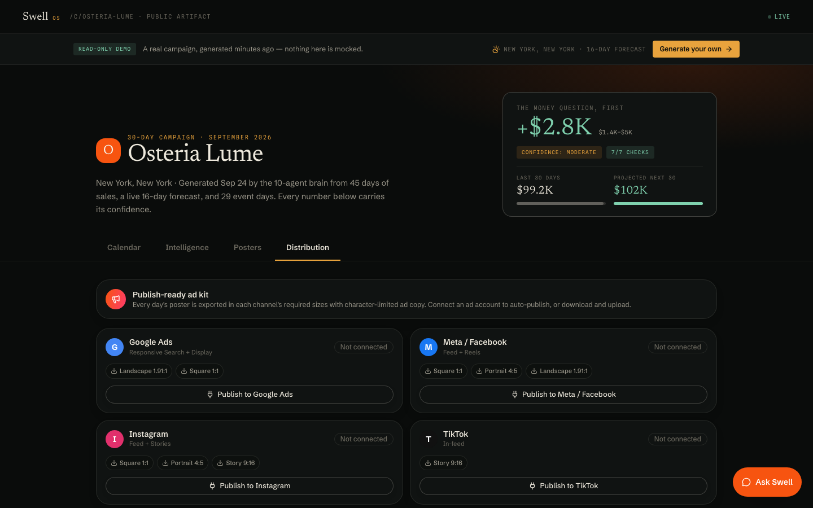
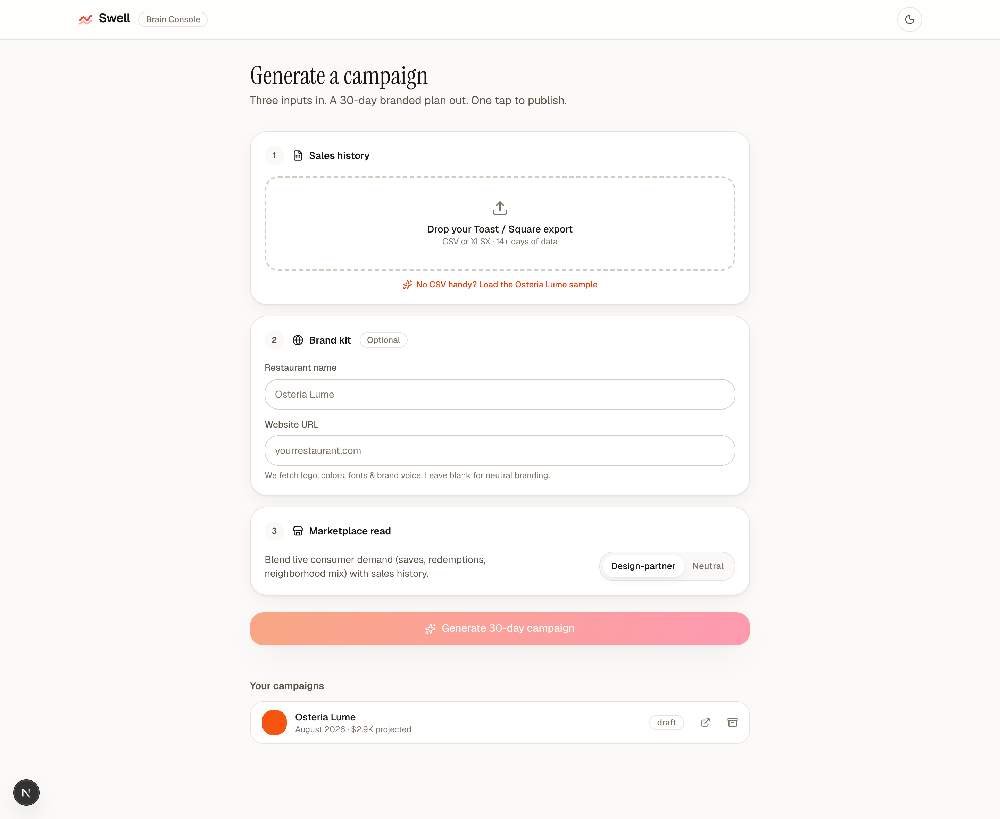

# Swell — Operator Side

> Restaurants don't need more tools. They need a brain that's been in the kitchen.

Upload 30–90 days of sales, paste a website URL, and Swell generates a **30-day
campaign** of recurring, on-brand discounts — with auto-branded marketing creative —
persisted and published as a shareable public URL.

This is the **operator side**: the Generator, the public Campaign Artifact, and the
internal Brain Console. Built to run and demo with **zero paid services and no API keys**.

[](https://github.com/rohitdvv/swell/actions/workflows/ci.yml)
[](https://vercel.com/new/clone?repository-url=https://github.com/rohitdvv/swell&env=SWELL_SESSION_SECRET&envDescription=Random%20string%20that%20signs%20auth%20session%20cookies)



|  |  |
| --- | --- |
|  |  |
| Public artifact — calendar with **live weather per day**, projected revenue, **live conditions** + **10-agent activity** | A poster for **every day**, auto-branded over real food imagery |
|  |  |
| **Distribution** — channel-ready ad kit (Google/Meta/IG/TikTok) + copy | The Brain Console — upload · paste · locate · generate |

---

> 📐 **Deep dive: [ARCHITECTURE.md](ARCHITECTURE.md)** — system diagrams, the 10-agent
> pipeline, revenue model math, auth/billing flow, data model, and API surface.

## The flow (enterprise)

**Sign up → sign in → choose a plan → pay (Stripe / demo) → Console.**
`/auth` creates the account (scrypt-hashed passwords, httpOnly sessions), `/pricing`
starts checkout for the signed-in account, and `/console` is gated: unauthenticated
visitors are redirected to sign-in, signed-in users without an active subscription are
sent to pick a plan.

## The three pieces

| Piece | Route | What it is |
|---|---|---|
| **Brain Console** | `/console` | Gated by account + active subscription. Upload CSV → paste URL + location → generate → edit any of the 30 deals → publish. |
| **The Generator** | `/api/generate` | The brain. Parses sales, extracts the brand kit, reads marketplace demand, composes a 30-day plan, writes copy, renders creative, persists to the DB. |
| **Campaign Artifact** | `/c/[slug]` | The public deliverable. Calendar + **Report** (sales vs projection charts) + **Posters** + **Distribution** tabs, Activate, inline edit. OG/Twitter share cards. No auth. |
| **Assistant** | floating "Ask Swell" | RAG chatbot on every campaign — answers the owner's questions ("why is Tuesday 30% off?") grounded in *their* campaign data. |

Start at **`/`** → **Get started** (sign up) → pick a plan → **`/console`**.

---

## Quick start

```bash
npm install
npm run dev          # http://localhost:3000
```

Then sign up at `/auth`, pick any plan (instant demo mode without a Stripe key), and in
the Console click **“Load the Osteria Lume sample”** —
a realistic 45-day NYC trattoria export is parsed live and turned into a full campaign.
No CSV or API key required.

---

## The brain is a team of agents

The generator runs as a **multi-agent orchestration** (`src/lib/orchestrator.ts`) — each
agent owns one job, hands its output to the next on a shared context, and every run
produces an inspectable **activity trace** (shown live in the artifact sidebar):

```
Brand ─┐
Demand ─┤
Location ─▶ Weather ─┐
                     ├─▶ Analyst ─▶ Strategy ─▶ Copywriter ─▶ Creative ─▶ Revenue
Events ──────────────┘
```

| Agent | Responsibility |
|---|---|
| **Brand Agent** | Reads the website → logo, palette, typography, voice vector, imagery |
| **Demand Agent** | Reads live marketplace demand (saves, redemptions, neighborhood mix) |
| **Location Agent** | Geocodes the venue to coordinates (Open-Meteo geocoding) |
| **Weather Agent** | Pulls the **live 16-day forecast** (Open-Meteo) — real-time, no key |
| **Events Agent** | Finds holidays + nearby ticketed events that move demand (Nager.Date; optional Ticketmaster) |
| **Analyst Agent** | Z-scores dayparts vs the venue's baseline, scores items by margin & mix |
| **Strategy Agent** | Composes 30 offers — item, window, discount — blended 70/30, **adapted to each day's weather & events** |
| **Copywriter Agent** | Writes one on-brand caption per day, through the claims/length guardrail |
| **Creative Agent** | Renders a branded **poster for every day** (colors, logo, food imagery) |
| **Revenue Agent** | Projects redemptions × lift and rolls up incremental revenue |

### Real-time intelligence (live, free, no keys)
Give Swell a **location** and three agents pull live real-world signal that reshapes the plan
day-by-day — visible in the artifact's **Live conditions** card and the agent trace:

- **Weather** (Open-Meteo, 16-day forecast): a **rainy/cool** day pushes a *comfort* dish at a
  deeper discount; a **warm/sunny** day features *lighter/patio* fare at a protected margin.
- **Events** (Nager.Date public holidays; Ticketmaster concerts/sports with an optional key):
  a holiday or nearby event **protects margin** and leads with a hero item to ride the crowd.
- Each day also carries an **inventory/prep hint** (expected covers) derived from the forecast.

Everything degrades gracefully — no location, an API hiccup, or dates beyond the forecast
horizon simply fall back to the sales-history plan.

### Distribution — a publish-ready ad kit
The **Distribution** tab turns the campaign into channel-ready ads: every poster is exported
in each platform's required aspect ratios (**1:1**, **4:5**, **9:16**, **1.91:1**) via one
adaptive `sharp` renderer, alongside **character-limited ad copy** (Google RSA headlines ≤30 /
descriptions ≤90, Meta primary text). Connect a Google/Meta ad account to auto-publish
(OAuth pipeline scaffolded), or download and upload.

### Auto-branded posters
Every day gets its own shareable poster (`src/lib/creative.ts`, `sharp`): the day's dish
photo (from the restaurant's own site imagery, or free [TheMealDB](https://www.themealdb.com)
food photography) composited under a **brand-colored duotone**, with the logo, offer, window,
caption and a Swell badge. Drinks/edge cases fall back to a clean brand-gradient poster.
Posters are disk-cached and pre-warmed on generation so the gallery is instant.

### "Ask Swell" — a RAG assistant on every campaign
A floating chat on the console and public artifact (`src/lib/assistant.ts`). It flattens
the campaign into retrievable **fact chunks** (revenue projection, per-day offers with
weather/event rationale, top sellers, strategy notes, how-to), ranks them against the
owner's question, and answers **only from those facts** — no invented numbers.

- **Keyless:** intent-matched answers computed straight from the campaign data.
- **With `ANTHROPIC_API_KEY` or free `GROQ_API_KEY`:** full LLM generation grounded in the
  retrieved chunks (classic RAG), same no-hallucination system prompt.

### Report — sales & projection infographics
The **Report** tab charts the story an owner actually asks for: last-30-days vs
projected-next-30 (before/after with uplift), net sales by day-of-week, a projected
daily-revenue curve with **live-event markers**, daypart mix with targeted windows
highlighted, top items, payment mix — all dependency-free theme-aware SVG
(`src/components/charts.tsx`).

## How the brain works

Three inputs → one campaign:

1. **Sales history** (`csv.ts`) — a flexible parser for Toast / Square transaction exports
   (CSV or XLSX). Derives net sales by daypart & day-of-week, top items, voids and payment
   mix. Rejects anything under 14 days.
2. **Brand kit** (`brand.ts`) — server-side fetch + Cheerio. Pulls logo, primary color
   (theme-color → CSS vars → dominant color from the logo via `sharp`), typography, tagline,
   and a free local **voice vector** (64-dim hashed TF) used to steer tone.
3. **Marketplace signal** (`marketplace.ts`) — the two-sided read: saves, past redemptions,
   neighborhood mix and a demand lift factor. Falls back to neutral signals when a restaurant
   isn't in the marketplace yet, so the generator never breaks.

The generator then:

- **Z-scores each daypart** against the venue's own baseline and targets the slowest windows.
- Scores items by **margin proxy + menu-mix (PMIX)**; picks hero vs. broad-appeal items.
- **Weights by marketplace demand** (70% sales history / 30% live demand): high organic pull →
  lower % off on a broad item (trial); low pull → deeper % off on a hero item (urgency).
- **Projects redemptions** = historical daypart orders × marketplace lift, and incremental revenue.
- Writes one **on-brand caption < 80 chars** per day through a **prohibited-claims + length
  guardrail** (`copy.ts`), then renders a branded **social creative** (`creative.ts`, `sharp`).

### LLM copy (optional)
Copy generation uses `ANTHROPIC_API_KEY` (Claude Sonnet, per spec) or a free `GROQ_API_KEY`
if present, and otherwise a deterministic on-brand template engine — so the demo always works.
The guardrail runs regardless and regenerates anything an LLM produces that fails.

---

## Tech

- **Next.js 16** (App Router) · React 19 · **Tailwind v4** · TypeScript
- **SQLite** via `better-sqlite3` — tables `restaurants`, `campaigns`, `campaign_days`,
  `marketplace_signals` (`src/lib/db.ts`)
- CSV `papaparse` · XLSX `sheetjs` · HTML `cheerio` · color + PNG `sharp`
- `framer-motion`, `lucide-react`

Everything free; no external APIs required.

---

## Subscriptions (`/pricing`, `/account`)

Swell ships with a working subscription layer — **Starter / Pro / Agency**, monthly or
annual, with plan limits (restaurants, campaigns, Ad Kit, auto-publish, white-label).

- **Checkout** uses **Stripe** (`src/lib/billing/*`). A Stripe **test key** runs real
  Checkout with no real charges; prices are created inline so no dashboard setup is needed.
- **No key? Demo mode.** The flow still works end-to-end — it activates a demo subscription
  against the entered email so you can see the paywall, account page, usage metering and plan
  gating without any setup.
- Sessions are a signed, http-only cookie (email-keyed account); Stripe webhooks keep the
  subscription lifecycle in sync (`/api/stripe/webhook`).

## Environment

Copy `.env.example` → `.env.local`. All values are optional — see the file for details
(`SWELL_SESSION_SECRET`, optional LLM keys, `DATABASE_URL`).

## API keys & tokens — exactly what unlocks what

**The app runs fully with zero keys.** Every key below is an optional upgrade; everything
degrades gracefully without it.

| Key | Cost | What it unlocks | Without it |
|---|---|---|---|
| *(none)* | — | Full pipeline: parsing, 10-agent brain, live weather/holidays/geocoding, posters, charts, assistant | — |
| `GROQ_API_KEY` | free | LLM captions + LLM RAG-assistant answers | deterministic on-brand engine (still good) |
| `ANTHROPIC_API_KEY` | paid | Claude-quality captions + assistant answers | same as above |
| `TICKETMASTER_API_KEY` | free | **Real concerts & sports** near the venue in the Events Agent | public holidays only |
| `STRIPE_SECRET_KEY` (+ `STRIPE_WEBHOOK_SECRET`) | free test mode | Real Stripe Checkout + billing portal | instant demo subscriptions |
| `DATABASE_URL` (Neon) | free tier | Persistent production Postgres | embedded PGlite (local disk) |
| Google Places API key | free tier | *(planned)* real Google-reviews infographics | not shown |
| Meta / Google Ads OAuth app | your accounts | *(scaffolded)* one-click ad publishing, stops before paid spend | download-and-upload ad kit |

---

## Deploy (free)

Swell runs on **Postgres** — embedded PGlite locally (zero setup), and any Postgres
(e.g. **Neon**) in production via `DATABASE_URL`. Same SQL both places, **no native DB
module** to compile, so it deploys cleanly to Vercel serverless.

**Go live on Vercel + Neon (free tiers), ~5 minutes:**

1. **Create a Neon project** → copy the pooled connection string.
2. **Import this repo into Vercel** ("New Project" → pick `rohitdvv/swell`).
3. **Set env vars** in Vercel → Settings → Environment Variables:
   - `DATABASE_URL` = your Neon string
   - `SWELL_SESSION_SECRET` (any random string — signs session cookies)
   - `NEXT_PUBLIC_BASE_URL` = your deployed URL (for share/OG images)
   - *(optional)* `STRIPE_SECRET_KEY` (test key) + `STRIPE_WEBHOOK_SECRET`, `ANTHROPIC_API_KEY`/`GROQ_API_KEY`
4. **Deploy.** Tables auto-create on first request. Done — a live, persistent URL.

Weather/events/geo need no keys; they call free public APIs at request time.

### Going live (enterprise) — what needs *your* accounts
The app is built so these plug in without rework; they're gated on credentials/legal setup,
not code:

- **Live ad auto-posting** — the Distribution kit is publish-ready; flipping on real posting to
  **Google/Meta Ads** requires your verified ad accounts + OAuth + ad-spend authorization.
- **Subscriptions / multi-tenant** — wire **Stripe** (test-mode works with a test key) for plans,
  seats and usage metering.
- **Persistence at scale** — swap `src/lib/db.ts` for **Neon / Vercel Postgres** (free tier); the
  `repo` interface is deliberately small and DB-agnostic.
- **Richer events** — set `TICKETMASTER_API_KEY` (free tier) to layer real concerts/sports on top
  of public holidays.

---

## Project map

```
src/
  app/
    page.tsx                    landing
    console/page.tsx            Brain Console (gate + wizard + board)
    c/[slug]/page.tsx           public artifact (+ OG metadata)
    pricing/ account/           subscription plans + billing dashboard
    api/…                       parse-csv, brand-kit, generate, campaigns,
                                campaign-days, creative, sample-csv,
                                assistant, billing/*, stripe/webhook
  lib/
    orchestrator.ts          ← multi-agent pipeline + activity trace
    generator.ts project.ts  ← Analyst / Strategy / Revenue phases
    brand.ts marketplace.ts  ← Brand / Demand agents
    context/                 ← Location / Weather / Events agents (live APIs)
    copy.ts                  ← Copywriter agent + guardrail
    creative.ts food-images.ts ← Creative agent (posters + ad kit)
    assistant.ts             ← RAG assistant (facts → retrieval → answer)
    billing/                 ← plans, Stripe, account session
    csv.ts db.ts sample.ts types.ts utils.ts
  components/
    campaign-board.tsx  campaign-report.tsx  charts.tsx  assistant-widget.tsx
    ui.tsx  modal.tsx  toaster.tsx  logo.tsx  theme-toggle.tsx
```
