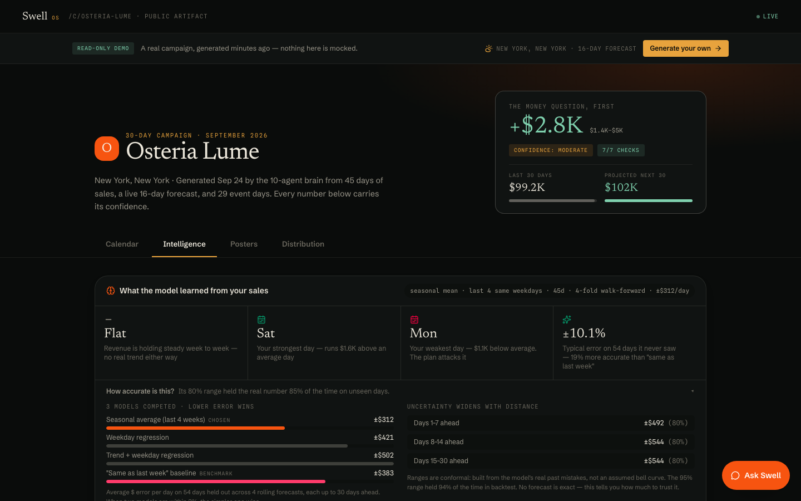

# Swell — Operator Side

> Restaurants don't need more tools. They need a brain that's been in the kitchen.

Upload 30–90 days of sales, paste a website URL, and Swell generates a **30-day
campaign** of recurring, on-brand discounts — with auto-branded marketing creative —
persisted and published as a shareable public URL.

This is the **operator side**: the Generator, the public Campaign Artifact, and the
internal Brain Console. Every AI feature is optional: with no LLM keys the whole pipeline
runs on deterministic engines and free public APIs.

### 🔗 Live: **[swell-ten-theta.vercel.app](https://swell-ten-theta.vercel.app)** · [Try the demo campaign](https://swell-ten-theta.vercel.app/demo) (free, no sign-up) · [Status](https://swell-ten-theta.vercel.app/api/health)

[](https://github.com/rohitdvv/swell/actions/workflows/ci.yml)
[](https://vercel.com/new/clone?repository-url=https://github.com/rohitdvv/swell&env=NEXT_PUBLIC_CLERK_PUBLISHABLE_KEY,CLERK_SECRET_KEY&envDescription=Clerk%20keys%20for%20Google%20%2B%20email%20sign-in)


|  |  |
| --- | --- |
|  |  |
| Campaign artifact — the money question first, calendar with **live weather + events per day** | A poster for **every day**, auto-branded over real food imagery |
|  |  |
| **Intelligence** — 3 models compete, calibrated ranges, “how accurate is this?” | **Distribution** — channel-ready ad kit (Google/Meta/IG/TikTok) + copy |

---

> 📐 **Deep dive: [ARCHITECTURE.md](ARCHITECTURE.md)** — system diagrams, the 10-agent
> pipeline, revenue model math, auth/billing flow, data model, and API surface.

## The flow

**Sign up → Console → build a campaign → publish.** No card, no plan picker in the way.
**Clerk** handles identity (Google or email) at `/sign-up` and `/sign-in`, and drops new
accounts straight into `/console`. Every account starts on **Free** (1 restaurant, 1 campaign a
month, regenerate as often as you like); `/pricing` upgrades to Starter / Pro / Agency via
Stripe. Plan limits are enforced on the server (`src/lib/billing/quota.ts` → `/api/generate`
returns 402 with an upgrade link), not just hidden in the UI. The landing page, `/pricing`,
the live `/demo` (read-only) and every **published** campaign URL stay public. Drafts are
private to their owner.

## The three pieces

| Piece | Route | What it is |
|---|---|---|
| **Brain Console** | `/console` | Any signed-in account (Free tier or a plan). Upload CSV → paste URL + location → generate → edit any of the 30 deals → publish. |
| **The Generator** | `/api/generate` | The brain. Parses sales, extracts the brand kit, reads marketplace demand, composes a 30-day plan, writes copy, renders creative, persists to the DB. |
| **Campaign Artifact** | `/c/[slug]` | The deliverable. Calendar + **Intelligence** (forecast with calibrated range, model card) + **Report** + **Posters** + **Distribution** tabs, Activate, inline edit (owner only). OG/Twitter share cards. Public once published. |
| **Assistant** | floating "Ask Swell" | RAG chatbot on every campaign — answers the owner's questions ("why is Tuesday 30% off?") grounded in *their* campaign data, behind input and output guardrails. |

Start at **`/`** → **Run it on your data** (sign up) → **`/console`**.

---

## Quick start

```bash
npm install
npm run dev          # http://localhost:3000
npm test             # model calibration, security & guardrail suites (Vitest)
```

Put the two Clerk keys in `.env.local` (see [Environment](#environment)). Then open `/demo`
for a finished campaign, or sign up at `/sign-up` (you land in the Console on the Free tier),
and click **“Load the Osteria Lume sample”** — a realistic 45-day
NYC trattoria export is parsed live and turned into a full campaign. No CSV or LLM key required.

| Script | Does |
|---|---|
| `npm run dev` | dev server with embedded Postgres (PGlite in `~/.swell`) |
| `npm test` | 120 Vitest tests — forecast calibration, SSRF, authz, AI guardrails, ingest, poster fonts, plan quotas |
| `npm run typecheck` · `npm run lint` · `npm run build` | what CI runs on every push |

---

## The brain is a team of agents

The generator runs as a **multi-agent orchestration** (`src/lib/orchestrator.ts`) — each
agent owns one job, hands its output to the next on a shared context, and every run
produces an inspectable **activity trace** (shown live in the artifact sidebar):

```
Brand ─┐
Demand ─┤
Location ─▶ Weather ─┐
                     ├─▶ Analyst ─▶ Strategy ─▶ Copywriter ─▶ Creative ─▶ Revenue
Events ──────────────┘
```

| Agent | Responsibility |
|---|---|
| **Brand Agent** | Reads the website → logo, palette, typography, voice vector, imagery |
| **Demand Agent** | Reads live marketplace demand (saves, redemptions, neighborhood mix) |
| **Location Agent** | Geocodes the venue to coordinates (Open-Meteo geocoding) |
| **Weather Agent** | Pulls the **live 16-day forecast**, then **climate normals** for days 17–30 (Open-Meteo) — real-time, no key |
| **Events Agent** | Finds holidays + nearby ticketed events that move demand (Nager.Date; optional Ticketmaster) |
| **Analyst Agent** (with `model.ts`: three forecasters compete under 30-day walk-forward cross-validation against a “same as last week” benchmark; the winner ships with horizon-calibrated conformal 80/95% ranges) | Z-scores dayparts vs the venue's baseline, scores items by margin & mix |
| **Strategy Agent** | Composes 30 offers — item, window, discount — blended 70/30, **adapted to each day's weather & events** |
| **Copywriter Agent** | Writes one on-brand caption per day, through the claims/length guardrail |
| **Creative Agent** | Renders a branded **poster for every day** (colors, logo, food imagery) |
| **Revenue Agent** | Projects redemptions × lift and rolls up incremental revenue |

### Real-time intelligence (live, free, no keys)
Give Swell a **location** and three agents pull live real-world signal that reshapes the plan
day-by-day — visible in the artifact's **Live conditions** card and the agent trace:

- **Weather** (Open-Meteo, 16-day forecast + seasonal normals beyond it): a **rainy/cool** day pushes a *comfort* dish at a
  deeper discount; a **warm/sunny** day features *lighter/patio* fare at a protected margin.
- **Events** (Nager.Date public holidays; Ticketmaster concerts/sports with an optional key):
  a holiday or nearby event **protects margin** and leads with a hero item to ride the crowd.
- Each day also carries an **inventory/prep hint** (expected covers) derived from the forecast.

Days beyond the 16-day forecast horizon use **seasonal climate normals** (the average of
that calendar date over the past 5 years). They are marked `est.` everywhere they appear,
nudge the discount half as hard as a real forecast, and are hidden from the copywriter so
no caption ever asserts weather we can't actually know. Everything else degrades gracefully
— no location or an API hiccup simply falls back to the sales-history plan.

### Distribution — a publish-ready ad kit
The **Distribution** tab turns the campaign into channel-ready ads: every poster is exported
in each platform's required aspect ratios (**1:1**, **4:5**, **9:16**, **1.91:1**) via one
adaptive `sharp` renderer, alongside **character-limited ad copy** (Google RSA headlines ≤30 /
descriptions ≤90, Meta primary text). Connect a Google/Meta ad account to auto-publish
(OAuth pipeline scaffolded), or download and upload.

### Auto-branded posters
Every day gets its own shareable poster (`src/lib/creative.ts`, `sharp`): the day's dish
photo (from the restaurant's own site imagery, or free [TheMealDB](https://www.themealdb.com)
food photography) composited under a **brand-colored duotone**, with the logo, offer, window,
caption and a Swell badge. Drinks/edge cases fall back to a clean brand-gradient poster.
Posters are disk-cached and pre-warmed on generation so the gallery is instant.
Text is set in **Geist**, bundled in `assets/fonts/` (SIL OFL) and wired into fontconfig by
`src/lib/poster-fonts.ts`, so posters render identically on font-less serverless hosts.

### "Ask Swell" — a RAG assistant on every campaign
A floating chat on the console and public artifact (`src/lib/assistant.ts`). It flattens
the campaign into retrievable **fact chunks** (revenue projection, per-day offers with
weather/event rationale, top sellers, strategy notes, how-to), ranks them against the
owner's question, and answers **only from those facts** — no invented numbers.

- **Keyless:** intent-matched answers computed straight from the campaign data.
- **With `XAI_API_KEY` (Grok), `ANTHROPIC_API_KEY`, or free `GROQ_API_KEY`:** full LLM
  generation grounded in the retrieved chunks (classic RAG), same no-hallucination system
  prompt. Priority: xAI → Anthropic → Groq.
- **Guarded both ways:** questions are screened for prompt injection (regex + the Llama Prompt
  Guard 2 classifier) before any model sees them, and an answer that states a number not
  present in the retrieved facts is thrown away in favour of the deterministic answer.

### Monday Brief + calendar + floor script
The product promise is that Swell **shows up Monday morning**. Every campaign has:

- **`/c/[slug]/brief`** — a print- and email-ready week-ahead letter (weather, events,
  prep covers, projected range). Copy to email/Slack, or print for the wall.
- **`.ics` calendar** — `/api/campaigns/[slug]/calendar` subscribes every offer into
  Google/Apple Calendar as all-day events with caption + prep notes.
- **Floor script** — one-tap copy of today's offer for texting the team.

### Investor pitch
**`/pitch`** — a meeting-ready brief: problem, product, moat, business model, stack.
Built for the raise as much as the restaurant sale.

### The money question, answered first
Last-30-days vs projected-next-30 sits **above the tabs**, not behind one: the two bars,
the uplift, and the projected range with a confidence label. Nothing about the campaign
is worth reading until the owner knows what it is worth.

### A range, not a promise
Two inputs cannot be measured from a POS export — how many guests act on an offer, and
how much of that spend is genuinely new rather than a discount handed to someone already
walking in. So Swell does not decorate a point estimate with an invented ±. It re-runs
the *same* projection at the pessimistic and optimistic edges of both, and shows the
band (`src/lib/validate.ts`). Thin sales history widens it. Confidence is **capped at
moderate** while demand signals are simulated, and drops to **low** under 21 days of
history — the product tells you when to trust it less.

The Report lists every assumption tagged `measured` / `assumed` / `simulated`, plus the
checks actually run against the generated plan: 30 days present, discounts inside the
10–45% guardrail, **redemptions never exceeding expected covers**, weather on every day,
captions under 80 characters, uplift a plausible size. Failures are shown, not hidden.

### Run history
Regenerating replaces a campaign, so every generation is logged to `campaign_runs`: when
it ran, what it read (forecast vs seasonal days, event days), what it projected, the
confidence, and how many checks passed. A regenerate cannot quietly rewrite what the
brain told you last week.

### Report — sales infographics
The **Report** tab charts the rest: net sales by day-of-week, a projected daily-revenue
curve with **live-event markers**, daypart mix with targeted windows highlighted, top
items, payment mix — all dependency-free theme-aware SVG (`src/components/charts.tsx`).

## How the brain works

Three inputs → one campaign:

1. **Sales history** (`csv.ts`) — a flexible parser for Toast / Square transaction exports
   (CSV or XLSX). Derives net sales by daypart & day-of-week, top items, voids and payment
   mix. Rejects anything under 14 days.
2. **Brand kit** (`brand.ts`) — server-side fetch + Cheerio. Pulls logo, primary color
   (theme-color → CSS vars → dominant color from the logo via `sharp`), typography, tagline,
   and a free local **voice vector** (64-dim hashed TF) used to steer tone.
3. **Marketplace signal** (`marketplace.ts`) — the two-sided read: saves, past redemptions,
   neighborhood mix and a demand lift factor. Falls back to neutral signals when a restaurant
   isn't in the marketplace yet, so the generator never breaks.

The generator then:

- **Z-scores each daypart** against the venue's own baseline and targets the slowest windows.
- Scores items by **margin proxy + menu-mix (PMIX)**; picks hero vs. broad-appeal items.
- **Weights by marketplace demand** (70% sales history / 30% live demand): high organic pull →
  lower % off on a broad item (trial); low pull → deeper % off on a hero item (urgency).
- **Projects redemptions** = historical daypart orders × marketplace lift, and incremental revenue.
- Writes one **on-brand caption < 80 chars** per day through a **prohibited-claims + length
  guardrail** (`copy.ts`), then renders a branded **social creative** (`creative.ts`, `sharp`).

### LLM copy (optional)
Copy generation uses `XAI_API_KEY` (Grok), `ANTHROPIC_API_KEY` (Claude), or a free
`GROQ_API_KEY` if present — otherwise a deterministic on-brand template engine, so the
demo always works with zero keys. The claims/length guardrail runs regardless and
regenerates anything an LLM produces that fails.

---

## Tech

- **Next.js 16.3** (App Router, `proxy.ts`) · React 19 · **Tailwind v4** · TypeScript
- **Postgres** — embedded PGlite locally, Neon (serverless) in production via `DATABASE_URL` (`src/lib/db.ts`)
- **Clerk** auth · **Stripe** billing · **zod** request schemas · **undici** SSRF-safe fetch
- LLMs: Groq (`gpt-oss-120b` → `qwen3.8-27b` → `gpt-oss-20b` chain), xAI or Anthropic — all optional;
  **Llama Prompt Guard 2** as an ML injection classifier
- CSV `papaparse` · XLSX `sheetjs` · HTML `cheerio` · image `sharp`
- **Vitest** — 100+ tests, run in CI with typecheck, lint and build on every push

---

## Security & trust

| Layer | What it does | Where |
| --- | --- | --- |
| **Tenant isolation** | Every campaign has an owner. Drafts are private (slugs are guessable), edits are owner-only, the demo is read-only, owner emails never leave the server. | `lib/authz.ts` |
| **SSRF defence** | User URLs (website, logo, images) are checked at *socket-connect time* inside the DNS lookup — defeats DNS rebinding and redirect-to-metadata. Streamed byte caps, pixel caps. | `lib/safe-fetch.ts` |
| **Input validation** | Every request body is a bounded zod schema: hex-only colours, http(s)-only URLs, capped arrays and strings. | `lib/schemas.ts` |
| **Rate limits** | Postgres-backed fixed windows (hold across serverless instances), fail-open. | `lib/rate-limit.ts` |
| **Headers** | Strict CSP, HSTS preload, `X-Frame-Options: DENY`, nosniff, Permissions-Policy, COOP. | `next.config.ts` |
| **AI input guardrail** | Regex screen + Llama Prompt Guard 2 classifier refuse prompt injection before any model sees it. | `lib/ai-guardrails.ts`, `lib/llm.ts` |
| **AI output guardrail** | Every number in an LLM answer must appear in the retrieved facts, or the answer is discarded for the deterministic engine's. | `lib/assistant.ts` |
| **Caption guardrail** | Prohibited claims / length checked on every generated and edited caption. | `lib/copy.ts` |

`GET /api/health` reports database and LLM status for uptime monitors (no secrets).

## How accurate is the forecast?

No forecast of a restaurant's sales is 100% accurate — weather, a local event or a viral post
move real numbers. Swell's promise is different: **as accurate as your data allows, and honest
about the rest.**

- **Model selection by the future, not the past.** A seasonal mean, a weekday ridge model and a
  trend + weekday ridge model each forecast 30 days ahead from many rolling origins
  (walk-forward CV). The most accurate wins; near-ties go to the simpler model.
- **Benchmarked.** Every model is scored against “same as last week” (skill %, MASE).
- **Calibrated ranges.** Split-conformal intervals, calibrated separately for week 1, week 2 and
  weeks 3–4, so an “80% range” contains the real number ~80% of the time.
- **Proven in tests.** Across 40 simulated restaurants and 1,200 future days, the 80% range covered
  82.8% and the 95% range 97.3%; the model beat the naive benchmark 40/40. Forecasts are
  identical in every timezone.

---

## Subscriptions (`/pricing`, `/account`)

Swell ships with a working subscription layer — **Free**, then **Starter / Pro / Agency**,
monthly or annual, with plan limits (restaurants, campaigns, Ad Kit, auto-publish, white-label).

- **Checkout** uses **Stripe** (`src/lib/billing/*`). A Stripe **test key** runs real
  Checkout with no real charges; prices are created inline so no dashboard setup is needed.
- **No key? Demo mode.** The flow still works end-to-end — it activates a demo subscription
  against the entered email so you can see the paywall, account page, usage metering and plan
  gating without any setup.
- Clerk owns the session; the email is the account key and is mirrored into the local
  `users` table on first sight. Stripe webhooks keep the subscription lifecycle in sync
  (`/api/stripe/webhook`), and `/api/billing/bind` refuses a Checkout session that does
  not belong to the signed-in email.

## Environment

Copy `.env.example` → `.env.local`. Sign-in needs the two Clerk keys; everything else is
an optional upgrade — see the file for details.

## API keys & tokens — exactly what unlocks what

**The app runs fully with zero keys.** Every key below is an optional upgrade; everything
degrades gracefully without it.

| Key | Cost | What it unlocks | Without it |
|---|---|---|---|
| *(none)* | — | Full pipeline: parsing, 10-agent brain, live weather + seasonal normals, holidays, geocoding, posters, charts, projection range, assistant | — |
| `NEXT_PUBLIC_CLERK_PUBLISHABLE_KEY` + `CLERK_SECRET_KEY` | free tier | Sign up / sign in with Google or email; the gated console | public pages only — no console |
| `GROQ_API_KEY` | free | LLM captions + assistant answers (`gpt-oss-120b` chain) + Prompt Guard injection classifier | deterministic engine + regex injection screen |
| `XAI_API_KEY` | paid | Grok captions + assistant answers (highest priority) | next provider in the chain |
| `ANTHROPIC_API_KEY` | paid | Claude-quality captions + assistant answers | same as above |
| `TICKETMASTER_API_KEY` | free | **Real concerts & sports** near the venue in the Events Agent | public holidays only |
| `STRIPE_SECRET_KEY` (+ `STRIPE_WEBHOOK_SECRET`) | free test mode | Real Stripe Checkout + billing portal | instant demo subscriptions |
| `DATABASE_URL` (Neon) | free tier | Persistent production Postgres | embedded PGlite (local disk) |
| Google Places API key | free tier | *(planned)* real Google-reviews infographics | not shown |
| Meta / Google Ads OAuth app | your accounts | *(scaffolded)* one-click ad publishing, stops before paid spend | download-and-upload ad kit |

---

## Deploy (free)

Swell runs on **Postgres** — embedded PGlite locally (zero setup), and any Postgres
(e.g. **Neon**) in production via `DATABASE_URL`. Same SQL both places, **no native DB
module** to compile, so it deploys cleanly to Vercel serverless.

**Go live on Vercel + Neon (free tiers), ~5 minutes:**

1. **Create a Neon project** → copy the pooled connection string.
2. **Import this repo into Vercel** ("New Project" → pick `rohitdvv/swell`).
3. **Set env vars** in Vercel → Settings → Environment Variables:
   - `DATABASE_URL` = your Neon string
   - `NEXT_PUBLIC_CLERK_PUBLISHABLE_KEY` + `CLERK_SECRET_KEY` (Clerk → API keys)
   - `NEXT_PUBLIC_BASE_URL` = your deployed URL (for share/OG images)
   - *(optional)* `STRIPE_SECRET_KEY` (test key) + `STRIPE_WEBHOOK_SECRET`, `ANTHROPIC_API_KEY`/`GROQ_API_KEY`
4. **Deploy.** Tables auto-create on first request. Done — a live, persistent URL.

Weather/events/geo need no keys; they call free public APIs at request time.

### Going live (enterprise) — what needs *your* accounts
The app is built so these plug in without rework; they're gated on credentials/legal setup,
not code:

- **Live ad auto-posting** — the Distribution kit is publish-ready; flipping on real posting to
  **Google/Meta Ads** requires your verified ad accounts + OAuth + ad-spend authorization.
- **Subscriptions / multi-tenant** — wire **Stripe** (test-mode works with a test key) for plans,
  seats and usage metering.
- **Clerk production instance** — switch from Clerk development keys to a production instance
  (custom domain) before real customers sign in.
- **Monitoring** — point an uptime monitor (Better Stack, UptimeRobot, Checkly) at
  `/api/health`; it returns 503 when the database is unreachable.
- **Richer events** — set `TICKETMASTER_API_KEY` (free tier) to layer real concerts/sports on top
  of public holidays.

---

## Project map

```
src/
  proxy.ts                      Clerk middleware — protects /console, /account, mutating APIs
  app/
    page.tsx                    landing
    demo/                       free, read-only demo campaign
    console/page.tsx            Brain Console (gate + wizard + board)
    c/[slug]/                   campaign artifact (+ OG metadata) · brief/ Monday Brief
    pricing/ account/           subscription plans + billing dashboard
    sign-in/ sign-up/ pitch/    Clerk auth pages · investor brief
    not-found.tsx error.tsx     OS-styled 404 / error pages
    api/…                       generate, parse-csv, brand-kit, campaigns (+ action,
                                calendar), campaign-days, creative, sample-csv,
                                assistant, runs, health, billing/*, stripe/webhook
  lib/
    orchestrator.ts          ← multi-agent pipeline + activity trace
    generator.ts project.ts  ← Analyst / Strategy / Revenue phases
    model.ts                 ← forecasting: walk-forward CV model selection + conformal ranges
    validate.ts              ← projection range, confidence, plan checks
    brand.ts marketplace.ts  ← Brand / Demand agents
    context/                 ← Location / Weather / Events agents (live APIs)
    copy.ts                  ← Copywriter agent + caption guardrail
    creative.ts food-images.ts ← Creative agent (posters + ad kit)
    assistant.ts llm.ts      ← RAG assistant · LLM client (provider chain, Prompt Guard)
    authz.ts                 ← who can view / edit a campaign (the only place)
    safe-fetch.ts            ← SSRF-safe fetch for user URLs
    schemas.ts rate-limit.ts ai-guardrails.ts ← validation · abuse limits · AI guardrails
    billing/                 ← plans, Stripe, account session
    csv.ts db.ts sample.ts types.ts utils.ts
  components/
    campaign-board.tsx campaign-insights.tsx campaign-report.tsx charts.tsx
    assistant-widget.tsx os-nav.tsx landing/ ui.tsx modal.tsx toaster.tsx …
test/
  model.test.ts security.test.ts ai-guardrails.test.ts ingest.test.ts poster-fonts.test.ts
  quota.test.ts
assets/fonts/                   Geist TTFs for server-rendered posters (SIL OFL)
```
