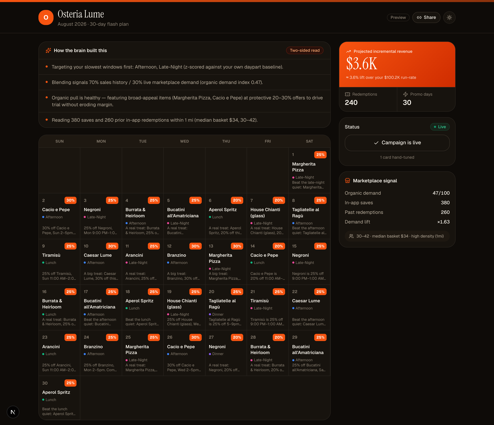
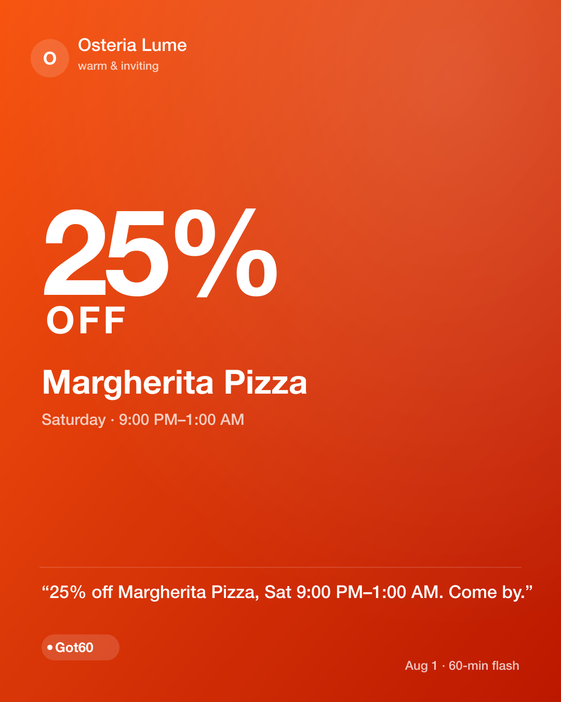

# Got60 — Operator Side

> Restaurants don't need more tools. They need a brain that's been in the kitchen.

Upload 30–90 days of sales, paste a website URL, and Got60 generates a **30-day
campaign** of recurring, on-brand discounts — with auto-branded marketing creative —
persisted and published as a shareable public URL.

This is the **operator side**: the Generator, the public Campaign Artifact, and the
internal Brain Console. Built to run and demo with **zero paid services and no API keys**.

[](https://github.com/rohitdvv/got60/actions/workflows/ci.yml)
[](https://vercel.com/new/clone?repository-url=https://github.com/rohitdvv/got60&env=NEXT_PUBLIC_BRAIN_PASSWORD&envDescription=Shared%20password%20for%20the%20Brain%20Console%20(e.g.%20got60))


|  |  |
| --- | --- |
|  |  |
| The public campaign artifact — calendar, projected revenue, marketplace signal | The Brain Console — upload · paste · generate |
|  |  |
| Full light/dark theming | Auto-branded social creative, rendered per deal |

---

## The three pieces

| Piece | Route | What it is |
|---|---|---|
| **Brain Console** | `/console` | Internal tool (shared-password gate). Upload CSV → paste URL → generate → edit any of the 30 deals → publish. |
| **The Generator** | `/api/generate` | The brain. Parses sales, extracts the brand kit, reads marketplace demand, composes a 30-day plan, writes copy, renders creative, persists to the DB. |
| **Campaign Artifact** | `/c/[slug]` | The public deliverable. Calendar grid + projected revenue/redemptions + Activate + inline edit. OG/Twitter share cards. No auth. |

Start at **`/`** for the landing page, or jump straight to **`/console`** (password: `got60`).

---

## Quick start

```bash
npm install
npm run dev          # http://localhost:3000
```

Then open `/console`, enter `got60`, and click **“Load the Osteria Lume sample”** —
a realistic 45-day NYC trattoria export is parsed live and turned into a full campaign.
No CSV or API key required.

---

## How the brain works

Three inputs → one campaign (`src/lib/generator.ts`):

1. **Sales history** (`csv.ts`) — a flexible parser for Toast / Square transaction exports
   (CSV or XLSX). Derives net sales by daypart & day-of-week, top items, voids and payment
   mix. Rejects anything under 14 days.
2. **Brand kit** (`brand.ts`) — server-side fetch + Cheerio. Pulls logo, primary color
   (theme-color → CSS vars → dominant color from the logo via `sharp`), typography, tagline,
   and a free local **voice vector** (64-dim hashed TF) used to steer tone.
3. **Marketplace signal** (`marketplace.ts`) — the two-sided read: saves, past redemptions,
   neighborhood mix and a demand lift factor. Falls back to neutral signals when a restaurant
   isn't in the marketplace yet, so the generator never breaks.

The generator then:

- **Z-scores each daypart** against the venue's own baseline and targets the slowest windows.
- Scores items by **margin proxy + menu-mix (PMIX)**; picks hero vs. broad-appeal items.
- **Weights by marketplace demand** (70% sales history / 30% live demand): high organic pull →
  lower % off on a broad item (trial); low pull → deeper % off on a hero item (urgency).
- **Projects redemptions** = historical daypart orders × marketplace lift, and incremental revenue.
- Writes one **on-brand caption < 80 chars** per day through a **prohibited-claims + length
  guardrail** (`copy.ts`), then renders a branded **social creative** (`creative.ts`, `sharp`).

### LLM copy (optional)
Copy generation uses `ANTHROPIC_API_KEY` (Claude Sonnet, per spec) or a free `GROQ_API_KEY`
if present, and otherwise a deterministic on-brand template engine — so the demo always works.
The guardrail runs regardless and regenerates anything an LLM produces that fails.

---

## Tech

- **Next.js 16** (App Router) · React 19 · **Tailwind v4** · TypeScript
- **SQLite** via `better-sqlite3` — tables `restaurants`, `campaigns`, `campaign_days`,
  `marketplace_signals` (`src/lib/db.ts`)
- CSV `papaparse` · XLSX `sheetjs` · HTML `cheerio` · color + PNG `sharp`
- `framer-motion`, `lucide-react`

Everything free; no external APIs required.

---

## Environment

Copy `.env.example` → `.env.local`. All values are optional — see the file for details
(`NEXT_PUBLIC_BRAIN_PASSWORD`, optional LLM keys, `GOT60_DB`).

---

## Deploy (free)

The app is a standard Next.js app and builds clean (`npm run build`).

- **Any always-on host** (Render / Railway / Fly free tier, or a small VPS): works as-is —
  SQLite persists to `./data/got60.db`. Point `GOT60_DB` at a writable volume.
- **Vercel**: deploys, but serverless filesystems are ephemeral, so campaigns won't persist
  across cold starts. For production, swap `src/lib/db.ts` for a free **Neon / Vercel Postgres**
  (the `repo` interface is small and DB-agnostic by design).

> Note: `better-sqlite3` and `sharp` are native modules. On CI/hosts that gate install
> scripts, allow them so prebuilt binaries download (the host's “allow build scripts” toggle).

---

## Project map

```
src/
  app/
    page.tsx                    landing
    console/page.tsx            Brain Console (gate + wizard + board)
    c/[slug]/page.tsx           public artifact (+ OG metadata)
    api/…                       parse-csv, brand-kit, generate,
                                campaigns, campaign-days, creative, sample-csv
  lib/
    csv.ts brand.ts marketplace.ts generator.ts project.ts
    copy.ts creative.ts db.ts sample.ts types.ts utils.ts
  components/
    campaign-board.tsx  ui.tsx  modal.tsx  toaster.tsx  logo.tsx  theme-toggle.tsx
```
